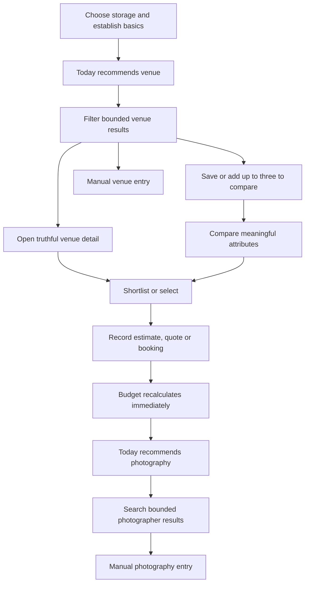

# Native app responsive wireframes

Date: 20 August 2026

Status: local interaction specification. These are structural wireframes, not
approved final artwork or runtime screens. They preserve the existing EverAft
visual language while proving that the connected journey fits a small iPhone.

## Visual continuity

Native should feel recognisably EverAft without copying web markup:

- deep forest primary text/action (`#173526` reference from the current web UI);
- warm cream page and image-placeholder surfaces;
- restrained terracotta accent (`#9c542d` reference from the current web UI);
- warm neutral borders and dark warm-grey body text;
- editorial display type for short headings, system text for controls and data;
- rounded but not excessively nested surfaces; and
- real permission-qualified imagery, an explicitly labelled representative
  treatment or an honest no-image state—never unrelated sample photography.

N2 converts these references into semantic native tokens and verifies contrast
in light/dark platform settings. Hex values here do not authorise scattered
literal colours in components.

## Adaptive layout model

Layout responds to usable width and text scale, not device names.

| Class | Usable width | Navigation | Content pattern |
| --- | --- | --- | --- |
| Compact | 320–430 pt, or larger width forced compact by text scale | Four-item bottom tab bar | One primary column; full-height filter/action sheets; one dominant action |
| Regular | 431–767 pt | Bottom tabs | Wider single column; two compact summaries/cards only when text fits |
| Expanded | 768 pt and above | Four-item navigation rail | List/detail split for discovery; content/summary split for plan; modal actions remain bounded |

Rules:

- Respect top and bottom safe areas; no essential content sits under a sensor,
  home indicator, system gesture area or keyboard.
- A screen owns one vertical scroll container. Nested vertical scrolling is not
  used for cards, filters or forms.
- Bottom actions lift above the keyboard and never cover validation/error text.
- At large accessibility text sizes, regular/expanded layouts may fall back to
  compact structure rather than clipping or shrinking text.
- Landscape is an adaptation, not a separate information architecture.
- Bottom tabs retain labels; an icon alone is never the only visible cue.

## Venue-first journey



The user can leave and resume after every node. Device-only and connected plans
use the same screens; storage/sync truth changes, not the product vocabulary.

## Compact wireframes

The diagrams use a 36-character content frame to keep the critical order honest
at approximately 320 pt. Bracketed labels are controls; plain lines are content.

### 1. Plan start

```text
┌────────────────────────────────────┐
│ My EverAft                 Step 1/4│
│                                    │
│ Tell us about your day             │
│ We will use this to shape the plan.│
│                                    │
│ Wedding date                       │
│ [  Not decided yet             ▾ ] │
│                                    │
│ Scottish location                  │
│ [  Town, council area or region  ] │
│                                    │
│ Expected guests                    │
│ [  Not sure yet                  ] │
│                                    │
│ [Continue]                         │
│ Save and leave                     │
└────────────────────────────────────┘
```

Behavior:

- Date supports exact date, season/year and unknown without inventing certainty.
- Unknown values remain valid and are surfaced later as useful setup actions.
- Budget and ranked priorities follow in the same low-density step pattern.
- Storage choice appears before any cloud promise: `On this device` or
  `Connected My EverAft`, with the latter unavailable when the capability is
  disabled.
- Back preserves values; leaving never creates a half-connected workspace.

Reading order: progress, heading, explanation, fields, primary action, leave.

### 2. Today — useful return

```text
┌────────────────────────────────────┐
│ My EverAft             On device ● │
│ Good morning                       │
│                                    │
│ NEXT FOR YOUR DAY                  │
│ Choose a venue                     │
│ A venue sets the shape of your     │
│ budget and supplier search.        │
│ [Explore venues]                   │
│                                    │
│ Budget                             │
│ £20,000 total     £20,000 remaining│
│ £0 committed      £0 paid          │
│                                    │
│ Coming up                         >│
│ No deadlines yet                   │
│                                    │
│ Today  Discover  Plan  You         │
└────────────────────────────────────┘
```

Behavior:

- One recommendation dominates; secondary progress never becomes a dashboard
  of decorative cards.
- The sync/storage state is visible, spoken and never colour-only.
- Once a venue is selected, the recommendation becomes photography unless an
  overdue payment or task has higher domain priority.
- Cached content renders first; background refresh cannot reorder content while
  the user is interacting without an announced update.

### 3. Venue search

```text
┌────────────────────────────────────┐
│ ‹ Discover                         │
│ Find your venue                    │
│ [Scotland            ] [Filters 2] │
│ 28 venues · Page 1 of 4            │
│                                    │
│ ┌────────────────────────────────┐ │
│ │ [permission-qualified image]   │ │
│ │ Approved photography           │ │
│ │ Achnagairn Estate              │ │
│ │ Inverness · Country estate     │ │
│ │ From £… / planning price cue   │ │
│ │ [Save] [Compare] [Open]        │ │
│ └────────────────────────────────┘ │
│                                    │
│ ┌────────────────────────────────┐ │
│ │ Representative image · labelled│ │
│ │ Next venue…                    │ │
│ └────────────────────────────────┘ │
│                                    │
│ [Load 8 more]                      │
│ Add a venue EverAft does not list  │
│ Today  Discover  Plan  You         │
└────────────────────────────────────┘
```

Behavior:

- The count and page describe server results; only loaded pages live on device.
- A fixed 4:3 media slot prevents movement while images load. No dimensions are
  fabricated if the API lacks them.
- `Save`, `Compare` and `Open` remain distinct. Shortlist/select actions live in
  detail or compare so cards stay scannable.
- Load-more is explicit by default; safe near-end loading may be enabled only
  after focus position, error recovery and network behavior pass.
- Empty/end states retain manual entry and current filters.

### 4. Full-height filters

```text
┌────────────────────────────────────┐
│ Venue filters              [Close] │
│ 28 matches                         │
│                                    │
│ Location                           │
│ [Highlands                       ] │
│                                    │
│ Venue type                         │
│ [✓ Country estate] [ Castle ]      │
│ [  Barn          ] [ Hotel  ]      │
│                                    │
│ Guest capacity                     │
│ [ 80 ] to [ 140 ]                  │
│                                    │
│ Planning price                     │
│ [No maximum set                  ] │
│                                    │
│ [Show 28 venues]                   │
│ Clear all                          │
└────────────────────────────────────┘
```

Behavior:

- Opening copies applied filters into a draft. Close/back discards the draft;
  `Show` applies once and returns to the results heading.
- Result count updates through bounded/debounced requests; a request race cannot
  apply an older response to newer filter state.
- Selected state is visible and spoken. Every option has at least a 44 pt target.
- The keyboard does not hide the result count, error summary or apply action.

### 5. Venue detail

```text
┌────────────────────────────────────┐
│ [Back]                    [Save ♡] │
│ [approved hero — fixed aspect]     │
│ Approved photography               │
│                                    │
│ Achnagairn Estate                  │
│ Inverness, Highlands               │
│ Country estate · up to 200 guests  │
│                                    │
│ Planning price                     │
│ From £… / Quote required           │
│                                    │
│ What matters                       │
│ Exclusive use · accommodation …    │
│                                    │
│ About this venue                   │
│ Bounded description…               │
│ [View 7 approved photos]           │
│                                    │
│ [Shortlist]        [Select venue]  │
└────────────────────────────────────┘
```

Behavior:

- The title and key decision facts precede long prose and the on-demand gallery.
- Representative imagery is labelled at the media, not in a distant footnote.
- Withdrawn detail preserves a historical plan item but disables new selection.
- `Select venue` opens the commitment sheet; it never claims availability or
  books the venue by itself.
- The bottom action group remains reachable but does not obscure content or the
  final focus target.

### 6. Compare venues

```text
┌────────────────────────────────────┐
│ ‹ Results            Compare 2 of 3│
│ [Achnagairn]      [Airth Castle]   │
│                                    │
│ Planning price                     │
│ From £…          From £…           │
│                                    │
│ Capacity                           │
│ Up to 200        Up to 120         │
│                                    │
│ Accommodation                      │
│ Provided          Not provided     │
│                                    │
│ Exclusive use                      │
│ Yes               Not provided     │
│                                    │
│ [Open] [Select]  [Open] [Select]   │
│                                    │
│ [Compare third venue]              │
│ [Accessible linear view]           │
└────────────────────────────────────┘
```

Behavior:

- Compact mode compares two columns at once; a third candidate is selected into
  either column. Regular/expanded layouts may show all three.
- Attribute labels remain fixed; values are `Not provided`, never guessed.
- The accessible linear view groups every labelled attribute under one venue,
  then the next, avoiding a screen-reader traversal across ambiguous columns.
- Removing a candidate restores focus to the compare heading and announces the
  new count.

### 7. Add venue to plan

```text
┌────────────────────────────────────┐
│ Add Achnagairn to your plan [Close]│
│                                    │
│ What stage are you at?             │
│ ( ) Estimated                      │
│ ( ) Quoted                         │
│ ( ) Booked                         │
│                                    │
│ Cost                               │
│ [ £                         ]       │
│ [ ] Amount still to be confirmed   │
│                                    │
│ Availability                       │
│ [Not checked                    ▾]  │
│                                    │
│ [ ] Make this our selected venue   │
│                                    │
│ [Add to plan]                      │
└────────────────────────────────────┘
```

Behavior:

- `Booked` changes committed budget; `Estimated` and `Quoted` remain visible
  planning values but do not become commitments.
- Payment state is derived from recorded payments, not chosen as a contradictory
  second booking status.
- `Selected venue` is explicit and may be set for estimated/quoted planning
  while copy makes clear it is not a booking confirmation.
- Unknown cost is allowed and excluded from invented totals; validation explains
  exactly which summaries remain incomplete.
- Submit gives immediate local feedback, then reconciles with the selected
  repository mode. Closing never partially changes the plan.

### 8. Updated budget and next action

```text
┌────────────────────────────────────┐
│ Plan                         Synced│
│ Budget                             │
│ £20,000 total      £8,500 remaining│
│ £11,500 committed  £2,000 paid     │
│                                    │
│ Venue                              │
│ Achnagairn Estate         Booked ✓ │
│ £11,500 · £2,000 paid             >│
│ Next instalment £4,750 · 14 Oct    │
│                                    │
│ NEXT FOR YOUR DAY                  │
│ Find a photographer                │
│ Shaped by your venue, location and │
│ £8,500 remaining budget.           │
│ [Explore photography]              │
│                                    │
│ Today  Discover  Plan  You         │
└────────────────────────────────────┘
```

Behavior:

- Total, committed, paid and remaining values update in the same interaction;
  the canonical response can correct them without a full-screen rerender.
- Payment deadlines are actions, not decorative reminders.
- Photography receives venue/location/remaining-budget context. Date is carried
  into the plan but availability remains unchecked until a real response.

## Expanded adaptations

At 768 pt and above, information becomes easier to compare without changing
meaning:

```text
┌──────────┬──────────────────────┬─────────────────────────────┐
│ Today    │ Venue results        │ Selected venue detail       │
│ Discover│ Filters + page       │ Hero/facts/price/gallery    │
│ Plan     │ 8 bounded cards      │ Save/shortlist/select       │
│ You      │                      │                             │
└──────────┴──────────────────────┴─────────────────────────────┘
```

- Discovery uses navigation rail + results + detail only when each region has a
  useful minimum width; otherwise it returns to one column.
- Filters use a bounded side panel in expanded mode and the same full-height
  sheet in compact/regular mode.
- Plan uses content plus a summary/next-action region. Editing still opens one
  focused sheet so forms do not become dense desktop panels.
- Selecting a result updates the detail region and moves accessibility focus to
  its heading only when the action explicitly opened it; scrolling the list does
  not steal focus.
- Deep links can open detail full-screen and reconstruct the split layout after
  data resolves.

## Shared component contracts

| Component | Required input | Owns | Must not own |
| --- | --- | --- | --- |
| App chrome | Active route, auth/storage/sync state | Safe areas, tabs/rail, protected loading cover | Planning calculations or data fetching |
| Next-action panel | Validated recommendation DTO | Reason, destination, loading/updated announcement | Recommendation ordering |
| Budget summary | Calculated totals and currency | Number formatting and compact/expanded layout | Recalculation rules |
| Catalogue list | Validated page, filters, bookmark/compare state | Virtualization, pagination trigger, focus restoration | Server filtering or publication rules |
| Listing card | Lightweight listing DTO | Media slot, visual label, save/compare/open controls | Full gallery or whole plan |
| Listing detail | Detail DTO and decision state | Facts, bounded copy, on-demand gallery, actions | Catalogue query or booking claim |
| Compare view | Up to three detail-summary DTOs | Attribute presentation, candidate selection, linear alternative | Persistence beyond compare repository |
| Commitment sheet | Existing/new plan item draft | Validation UI and semantic submit intent | Totals, selected-venue or payment invariants |
| Sync status | Repository state | Calm label, retry/conflict destination | Network replay itself |

## Loading, empty and conflict frames

- Loading skeletons reserve the final media/card geometry and expose one busy
  label; they do not animate continuously under reduced motion.
- Cached data remains usable with a visible `Offline · last updated …` state.
- Search error preserves applied filters and loaded results, with retry adjacent
  to the failed page—not a destructive full-screen reset.
- Empty results show how filters constrained the search, `Clear filters`, and
  manual entry.
- A stale or withdrawn listing never disappears from an existing budget item;
  its detail explains availability and offers manual maintenance.
- A conflict identifies the affected section, local/remote update times and
  safe choices. It never silently picks a budget or seating winner.
- Connected-planning disabled or schema-unavailable states offer the supported
  device path without revealing database/table names.

## Accessibility acceptance for every wireframe

1. Visual order and accessibility traversal order match.
2. One screen heading receives focus after explicit navigation.
3. Controls expose role, label, value/state and validation relationship through
   React Native accessibility properties.
4. Saved, selected, booked, sync and error states never rely on colour alone.
5. Touch targets are at least 44 by 44 pt with adequate separation.
6. At maximum supported text scale, primary actions and monetary values reflow
   without clipping, overlap or horizontal page scrolling.
7. VoiceOver and TalkBack can complete setup, venue discovery, comparison,
   commitment and photography transition without gesture-only actions.
8. External web handoffs name their destination and restore native context on
   return.

## N2/N5/N6 evidence derived from these wireframes

- N2: compact and expanded app chrome, safe-area/keyboard matrix, Dynamic Type,
  tab/rail labels and seeded Today screen.
- N5: bounded results, filter draft/apply semantics, truth-labelled imagery,
  two-column compact compare plus linear alternative, manual entry and focus
  restoration.
- N6: commitment validation, immediate totals, selected-venue distinction,
  canonical reconciliation and venue-to-photography transition.
- N12: current small iPhone and representative Android physical-device golden
  journey, expanded layout, VoiceOver/TalkBack and reduced-motion verification.
